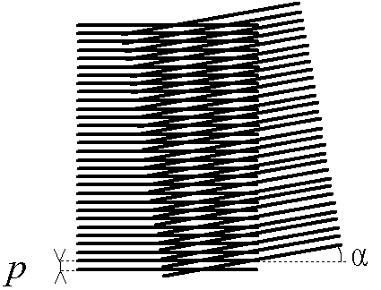
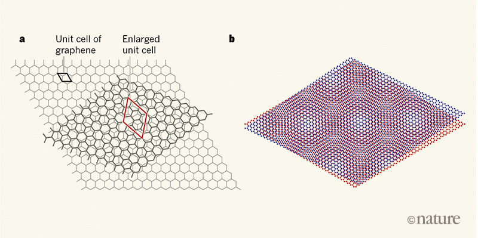

# Introduction, Background, and Motivation

## Physical Background: Motivation for Layered Materials

Conventional bulk solids are made of three-dimensional crystals with strong chemical bonding in between atomic constituents. Ever since the discovery of graphene \[[Nobel2010](https://www.nobelprize.org/nobel_prizes/physics/laureates/2010/press.html)\], there have been intense reserach investigations on  layered materials. These are materials with strong chemical bonding between the atoms in the same sheet and weaker van der Waals interactions between the neighboring sheets. Because of the nature of the weak interlayer bonding, individual sheets of atoms can be exfoliated via a mechanical method involving scotch tape. Ever since, the library of experimentally accessible 2D materials is constantly growing with new types of layers that can be exfoliated or fabricated. They can host a variety range of physical properties as well. For example, some layers can be magnetic or superconducting. There are great implications for the applications using these layered materials in industry or fundamental research.

Because they are sheets of materials, one might be interested in stacking different layers together to form a stack like a sandwich, and hope to engineer the stack with the desired properties by combining them properly. There are many 'control knobs' in forming the stack. For example, what types of layers could be used, and what the stacking twist angle and the geometry could be. Though it is exciting to imagine the possibility to use these layered materials, theoretically it is extremely challenging to simulate the layer stacks and give insights for the experimental parameters to be tested. 

To understand the difficulty, we can first look at the system from a geometric point of view. Moire patterns are the interference pattern created when two similar images are overlapping with each other. It can be observed in daily life such as the photography.

##  
### This Moire pattern photo is taken from the wikipedia page  on [Moire Patterns](https://en.wikipedia.org/wiki/Moir%C3%A9_pattern). It shows two identical planes of lines at a relative twist angle alpha. Note the periodic pattern that emerges in their _overlap_, which is characterized not just by the planes themselves but by alpha.

The overlap between two images would create a long-wavelength varying pattern in the combined image. The scale of this long-wavelength variation is determined by the degree of the mismatch between layers. The smaller the mismatch is, the larger the length scale is for the spatial variations. Similar phenomena would occur for atomic crystals as well, and the two-dimensional geometry for the layered materials are perfect to illustrate Moire pattern physics. 

For the example of the graphene, if we have two sheets on top of each other with about a 1 degree twist angle, the Moire pattern would have a length scale about 13 nanometer with a triangle lattice structure. For this super-structure, the large length scale atomic variation usually contains over **10,000 atoms** and this causes tremendous challenges for numerical simulations for these twisted bilayer system. DFT is virtually impossible at these scales.

However, if we zoom in on these twisted bilayer system, we can see locally they resemble the perfect aligned crystal with the relative shift between layers that depends on the location in the super-structure. In other words, this large scale sctructure can be viewed as a patching of various configurations of aligned crystals, each with a smaller size. Intuitively one can imagine that by studying the smaller structure of the crystal and their electronic properties and how they depend on the crystal layer shift, we can infer or construct the corresponding patched super-structure and reduce the computational resources that are needed to perform the simulation. This is in line with the multi-scale simulations.

A Density Functional Theory (DFT) + Wannier function-based technique, which we elaborate upon below, provides the necessary toolset for performing such task. First, for the smaller periodic crystal, the DFT+Wannier method is used to extract the orbital information, their coupling strength and the electronic properties, and how they vary with interlayer shift. After the basic ingredients for the modeling are obtained, we can patch these local models to form the global model for the super-structure and perform the electronic simulations. 

Overcoming this theoretical challenge to simulate the van der Waals heterostructure and twisted structure is crucial to advance the current semiconductor industry and fundamental physics research. One of the recent excitement is the discovery of superconductivity in the twisted bilayer graphene at "magic angle" (about one degree). An associated perspectives article is here: \[[Surprise graphene discovery could unlock secrets of superconductivity](https://www.nature.com/articles/d41586-018-02773-w)\]. For each individual graphene monolayer, superconductivity is not present unless it is in proximity with other conventional superconductors. The superconductivity displayed this way is not intrinsic to the graphene layers. However, what is really interesting and surprising is that when two layers of graphene are stacked with a small magic twist angle, the bilayer heterostructure becomes superconducting at about 1 Kelvin and it is intrinsic transport property. The origin of this superconductivity phase is still under intense debate and is the subject of current research. However, it is related to the peculiar electronic band structure in the twisted bilayer graphene. At this magic angle, a set of nearly flat bands are present and these bands with low dispersion and quenched kinetic energy are usually beneficial for inducing stronger interaction effects (from electron-electron mutual interaction). Ths superconductivity is expected to originate from the enhanced interaction effects.

## 

## From the [Nature views article](https://www.nature.com/articles/d41586-018-02660-4). The moire pattern that graphene produces is clearly visible.

Looking forward to the research with these van der Waals layer stacking, there are many open questions. How could we determine or engineer the proper layer structure and what is the geometry that we should create in order to manipulate the electronic properties to what we desire, how to optimize the combinations, and what should we be expecting for the new physics to emerge. These are extremely challenging and exciting to explore, but the efficient numerical approach and toolset are necessary to perform these simulations. One strong benefit of creating the database and having very efficient ways of querying the data entries for the related crystal types and geometry is extremely valuable to advance the theoretical approach. With the growing number of two-dimentional layered materials and various forms, our database can also be extended to many types and symmetries. One can proceed with the truly ab-initio simulations of these layer stacks, or derive the corresponding low-energy expansions and various handy models to describe them.

## Intro to Methods: DFT and Wannier Functions

Density functional theory (DFT) is the workhorse of computational condensed matter physics and physical chemistry. It allows users to compute a wide variety of material properties, such as electronic and mechanical structure, phonon/vibrational behavior, and geometric phase phenomena. However, DFT does not scale favorably with system size, and performing complicated electron orbital-structure or mechanical relaxation calculations for systems with more than a few dozen atoms becomes intractable. 

DFT typically generates wavefunctions that are in the plane-wave basis, so the periodicity across a crystal is easy to exploit. However, the use of an alternate wavefunction basis, Maximally Localized Wannier Functions (MLWF), allow us to visualize the electrons as being localized on individual atoms as well as determine the physical interaction strength, or coupling, between different orbitals. It can be advantageous to study a system from the basis of individual orbitals coupling to one another, as such a mathematical framework turns most calculations of system properties into comparatively fast routine linear algebra calculations.

Therefore, MLWF’s are useful to bring the toolset of DFT to bear on large systems. For instance, one of our group members demonstrated how parameterizing a tight binding model for Transition Metal Dichalcogenides could come from MLWF’s and DFT. \[[Fang 2015](https://arxiv.org/abs/1506.08860)\]; learning how to model two-dimensional twisted systems is a vigorous and active field of research, spurned on by the recent discovery of twisted bilayer graphene superconductors.

In order to study twisted bilayer TMDC systems, we need to understand the interactions between atoms in a wide variety of spatial configurations; even for modest twist angles, the periodicity which is necessary for DFT calculations is only accessible by very large systems of hundreds of atoms. Therefore, a tight-binding model informed by Wannier functions is one of the precious few techniques we have to approach calculating properties of twisted 2D systems.
