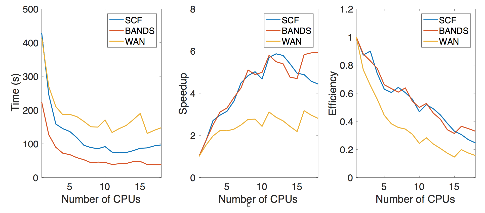
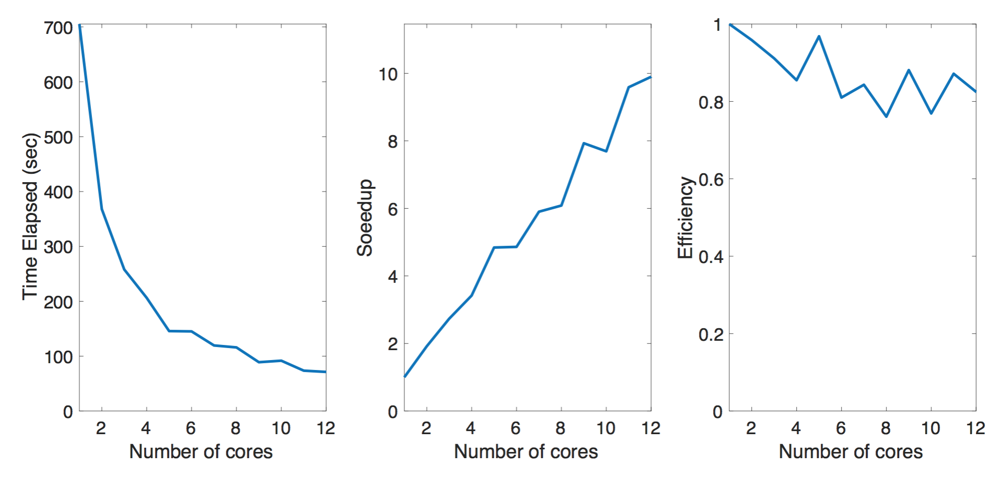

# Guide to Using Code 

**On this page, we provide a helpful overview to the course instructors explaining how to use the code we have provided in the Github Repository. Note that while we detail how to use VASP, as it is commercial software, we do not include a copy. Thus, we foucs on the code that can be run readily first, and provide details on the VASP calculation afterwards.**

# Code

In the course of developing an efficient look-up tool, we generated the following codes, which can be downloaded from [here](https://drive.google.com/drive/folders/1TPO2H14AS_1CgilDmRqsAZzv_I4oeqrX?usp=sharing). In this document, we detail:

- serial_query_profile.py 
- spark_query.py
- generate_model.py

### serial_query_profile.py

Serial_query_profile.py is a standard Python code generated to obtain the serial execution time of a single query along with a parallel execution time with a worker Pool. It reads all files into local memory, goes through every line of each file, and uses a list comprehension to parse the lines to find the desired k and l orbitals. It returns the lines as a list of floating point values (Dx,Dy,Dz,Coupling), and the time it takes from loading files to returning these values is collected and printed for each file.

When this code is executed, four tasks are completed – two serial and two parallel loadings, for all 400 files and for every N (“thoroughness”) files. The default N is 10, and the default number of workers is 12. 

### spark_query.py

Spark_query.py compares three spark-based implementations. All of them start by reading 400 data files into one dataframe, and return the floating point values as a numpy array. In the first implementation, the dataframe is transformed by dataframe.filter( ). Another implementation creates a temporary view of the dataframe and runs SQL directly on it. The last implementation partitions and writes the data in the format of parquet. The data are stored in new directories, with partitioning column values encoded in the path of each partition directory. When querying by orbital indices k and l, the data in the corresponding partition directory will be queried directly. Running this code gives the execution time of each implementation in an easily comparable format. 

### generate_model.py

Generate_model.py generates the Tight Binding Hamiltonian model, querying the already-generated parquet multiple times. It first constructs atom positions for the 2D material being studied, and computes displacements to perform interpolation and obtain corresponding electronic couplings. The TBH model is built from these couplings and printed in the output. In order to run this code, spark_query.py has to be first executed to create a parquet directory using the desired number of data files. The number of data files to be read can be specified by modifing the following part of spark_query.py.
```
# Set how many files needed to be read
files=[]
prefix='new_proc_wan_'
for i in range(400):
  #if i % 2 == 0: Uncomment to run on every other file (200 files)
  if i % 10 == 0: # this is for 40 files
      files.append(prefix+str(i))
````
## Guide to Running on AWS

In order to compare different implementations and make our results reproducible, we ran all of the above codes on AWS. The following are the guides to re-run our experiments using 400 files for serial_query_profile.py and 40 files for the others. Modifications of the codes are not necessary unless you would like to try with other number of files. We used 200 files to produce some of our results, so we have included comments for curious readers.

### Serial Loading

To execute serial_query_profile.py, please launch an AWS instance:

   - Amazon Machine Image (AMI): Ubuntu Server 16.04 LTS (HVM), SSD Volume Type
  
   - Instance type: 1 m4.4xlarge instance

No additional storage is required, and the default settings can be used for other configurations.
  
 
Confirm that Python is already installed:  
```
$ python3 --version 
$ Python 3.5.2
``` 
Then install the necessary packages:
```
$ sudo apt-get update
$ sudo apt-get install python-pip
$ sudo pip install numpy  
$ sudo apt-get install unzip
```
Now upload the zip file “new_proc_wan_serial” to the VM, and unzip:

`$ unzip new_proc_wan_serial.zip'

After following these steps, the Serial_query_profile.py code should be ready to be run in the new_proc_wan_serial directory:
```
$ cd new_proc_wan_serial
$ python serial_query_profile.py
```
A successful run will provide you with an output that looks like this:
```
Now profiling the file query process. Please run this in the same folder as the new_proc_wan files.
====================
Now reading in every data file in serial with thoroughness  2
Read file new_proc_wan_0 which took 0.350999 seconds
Read file new_proc_wan_2 which took 0.157147 seconds
Read file new_proc_wan_4 which took 0.331090 seconds
...
Now loading in every 10th file using a worker pool of 12 workers
Abbreviated parallel run (only every 10th data set)  took 1.942010 seconds
Checking to make sure that the two data sets are consistent:
Validation complete!
```

### Loading using Spark cluster

In order to run the data loading code using a Spark cluster, please follow these steps:

First, create a Spark cluster: 

- General configuration: Logging – off, Launch mode – Cluster
- Software configuration: Release – emr-5.8.0, Applications – Spark
- Hardware configuration: Instance type - m4.4xlarge, Number of Instances - 3 (1 master and 2 core nodes)

Upload the following folder and scripts to the cluster and HDFS
- new_proc_wan_40_files, which contain 40 data files
- spark_query.py
- generate_model.py

After uploading all the files, this is what you should see: 

```
$ hadoop fs -ls
Found 42 items
-rw-r--r--   1 hadoop hadoop       5451 2018-05-07 02:20 spark_query.py
-rw-r--r--   1 hadoop hadoop      16361 2018-05-07 02:20 generate_model.py
-rw-r--r--   1 hadoop hadoop   12502006 2018-05-07 02:29 new_proc_wan_0
-rw-r--r--   1 hadoop hadoop   12953864 2018-05-07 02:29 new_proc_wan_10
…
-rw-r--r--   1 hadoop hadoop   12998283 2018-05-07 02:29 new_proc_wan_60
-rw-r--r--   1 hadoop hadoop   12834758 2018-05-07 02:29 new_proc_wan_70
-rw-r--r--   1 hadoop hadoop   12893863 2018-05-07 02:29 new_proc_wan_80
-rw-r--r--   1 hadoop hadoop   12765595 2018-05-07 02:29 new_proc_wan_90
```


Submitting Spark_query.py will give you the execution times of different query methods described in XX. 

```
$ spark-submit --num-executors 2 --executor-cores 1 Spark_query.py
…
***************Reading files took 4.208967 second***************
***************Dataframe filter took 10.148717 second***************
***************Dataframe SQl took 8.787971 second***************
***************Partitioning took 111.486392 second***************
***************Reading parquet took 0.630539 second***************
***************SQL(only column) took 0.386598 second***************
***************Writing output took 0.065699 second***************
…
```
This creates a parquet directory myparquet_short.parquet inside HDFS, so if you are running this code multiple times, please remove myparquet_short.parquet before rerunning each time. `$ hadoop fs -rm -R -f myparquet_short.parquet`

Generate_model.py directly queries this parquet to obtain electronic coupling strengths, then computes and saves the TBH. Once you have created myparquet_short.parquet, please run:

```
$ time spark-submit --num-executors 2 --executor-cores 1 generate_model.py
…
 [[  1.00549900e+00  -9.93000000e-04  -2.38700000e-03 ...,   0.00000000e+00
0.00000000e+00   0.00000000e+00]
 ..., 
[  0.00000000e+00   0.00000000e+00   0.00000000e+00 ...,   0.00000000e+00
0.00000000e+00   0.00000000e+00]]

real	2m32.403s
user	2m56.752s
sys	0m4.528s
```
If you are reproducing the results with 200 files, it could be faster to upload the zip file new_proc_wan_200_files.zip, unzip, upload to the HDFS, and move all the files outside of the folder. Please remove the original empty folder after doing so.

```
$ hadoop fs -put new_proc_wan_200_files
$ hadoop fs -mv new_proc_wan_200_files/new* .
$ hadoop fs -rm -R -f new_proc_wan_200_files
```


### Instructions for VASP+Wannier90

To generate the data set, one needs the following code installed in the computing resource:

Density Functional Theory (DFT) code: Vienna Ab initio Simulation Package (VASP) : https://www.vasp.at/
Wannier functions and transformations from DFT: Wannier90 at http://www.wannier.org/

To install these codes, the instructions can be found from the corresponding webpage, introduction files in the code package. We will not repeat the details here. In many supercomputing centers some codes are also compiled already and packaged into a module to be used. Users can replace the corresponding name/path to the executable to run the script.

The example setup folder to execute the computation is in the GitHub. First, the setups for running VASP DFT code can be seen in KSCAN subfolder. Within this folder:

SCF folder is the first stage of the calculation for VASP DFT which completes the self-consistent calculations for the electron charge and other physical quantities. The charge information can then be passed to the next stage of the calculations.
BANDS folder runs the non self-consistent calculations to derive the band structure corresponding to the crystal structure. This is to be used to validate the quality of Wannier interpolation for the band structure in the next stage.
WAN folder is the final stage to derive the Bloch wave functions and perform the Wannier transformation to obtain the localized Wannier basis function as atomic orbitals. The VASP code is executed first to derive the necessary projections for obtaining Wannier orbitals and then Wannier90 code continues with these projections to derive the localized orbitals and the tight-binding model.

Brief descriptions for the input files:
INCAR: which contains the input parameters for running the VASP DFT code such as the energy cutoff, flags to steer the calculations
KPOINTS: the mesh grid or sampling of k points in the reciprocal space
POTCAR: the pseudo potential files for each atomic species to be used in DFT simulations.
POSCAR: contains the descriptions for the crystal structure including the primitive vectors for the real space and the basis positions for the constituent atoms.
wannier90.win: setup file for executing Wannier90 code to derive Wannier orbitals and the modeling for the band structure. For example, this file specifies the energy window to derive the model, what types of atoms / orbitals should be included, etc.

As we see in the introduction, we are going to sample various configurations for the crystal structure. To prepare the files appropriate (POSCAR and wannier90.win files) for each calculation, the script gen_pos.py performs the task and generates 400 different configurations for the stacked TaS2 bilayer crystal. All the files generated will be stored in the allpos subfolder.

For the vasp_wan.py script, this prepares the environment to start the VASP+Wannier90 simulations. This script is designed to simulate the TaS2 crystal in our studies with the corresponding parameters. However, this can be easily tuned to the desired crystal type and different symmetry types. This script repeatedly execute 400 configurations for the varied TaS2 crystal. The results of the simulation of Wannier modeling will be stored in the data subfolder.

The main workhorse to generate the data is the VASP code which is a commercial DFT code. We are not changing the code for the purpose of the class project, however we would like to gauge the performance of this DFT code in terms of the number of CPU used to execute the code. However, we note that this is a very complicated code and depending on the number of CPUs used to execute the code, the default parameters in performing the simulation would adjust themselves as well. For example, the number of bands in the electronic structure will be changed to be the multiples of the number of the CPUs. This means, it will not be completely fair to compare the performance depending on the number of CPUs. However, we can still roughly see how the performance scale at the size of our crystal structure and simulation scale here. We find about 6-8 CPUs are suitable for running the simulation.




### Postprocessing for Wannier90 data

One very interesting aspect of our project is, we have to prepare our own data set to start with by running VASP+Wannier90 rather than working with existing data available on the internet/database. This gives us the chance to think about how we can clean up and manage, distill the necessary information from simulation results. We among the group members discuss over the appropriate data structure to be presented and processed before feeding into the follow-up database stage/process. 

After the discussion, we design the post process script that wraps the detailed physics background into the concise postprocessed files. These files from the wrapper contains only the essential information for the orbital coupling. These can be represented by each data entry which contains the following information for the coupling and features:

For the initial atom site, what is the atomic type, orbital type, orbital index
For the final atom site, what is the atomic type, orbital type, orbital index
The geometry, what is the displacement vector (relative position) between these two orbitals (the hopping direction/vector)
The strength for the coupling, the real part and the imaginary part of the hamiltonian.
Neighboring environment: the primitive vectors for the crystal (a1 and a2) which encodes the compressions and strain information of the parent crystal.
Further generalizations are also possible to capture other ways to vary the crystal confutation. In other words, other features to identify and specify the configuration and later would be used for potentially machine learning algorithm. This can be done by simply adding processing modules to the postprocess script and derive the necessary information to be retained. They can be added as additional data column.
Additional filters can be added to the wrapper to remove the unnecessary information. Though this is not implemented in our code here. For example, to reduce the size of the data set, we can remove the atomic coupling that has a very large hopping distance (we can set a cutoff radius). The physical idea is that, the larger the hopping range is, the smaller the coupling will be and hence can be ignored from the recording the essential atomic coupling information in the database.

The Postprocessing script reads the information from the corresponding POSCAR (crystal structure) and hamiltonian modeling file (*_hr.dat) and the implementation can be found in rec_proc.py. This will go through the all 400 sets of files from the output to process them into more intuitive files (new_proc_wan_*) which contains the atomic couplings. This script can be parallelized by multiprocessing module provided in the standard Python interpreter. As in the plot, we observe the improved performance when we parallelize the data processing. The benchmark is done with a subset (100 sets) of the full data (400 sets) we have. The machine we have has 12 physical cores and we investigate the performance up to 12 cores using pool function in multiprocessing toolkit. As the note, we also test the performance for data stored on the solid state drive and the conventional magnetic hard disk. The solid state drive provides slightly better performance over the conventional magnetic storage device.



