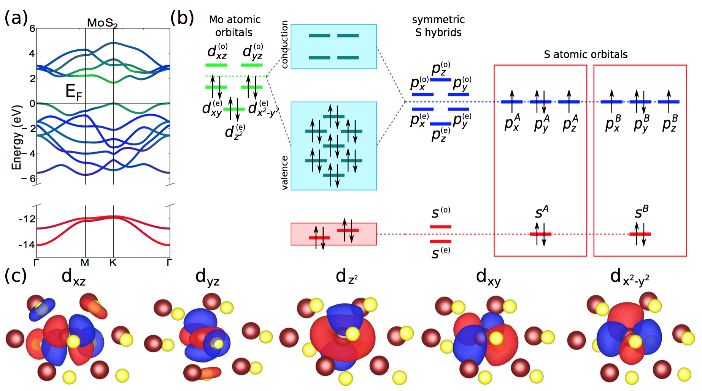

# Overview and Methods

**On this page, we review what we are attempting to do and explain our toolkit for generating the data sets (DFT and Wannier90). We explain our data management later.**

## Overview
Our chief concerns are as follows. It is very time-expensive to generate data sets for different bilayer material configurations. The DFT + Wannierization software is already optimized for parallel execution over cores, and is best regarded as a black box; therefore, embarrassingly parallel execution of the code via a wrapper code for a wide variety of configurations is how we aim to optimize this step. For the management and utilization of the resulting dataset, we turn to Spark and examine other database models to rapidly query the database for different orbital-orbital coupling strengths. The advantage of this parallelization is that it allows for faster querying of the computed values for accurate tight-binding Hamiltonian parameterization.

The computational tasks we are addressing are therefore:

1. Generation of DFT-based datasets, and their Wannierization.
2. Post-processing of these datasets into files which are easily parsed by other code.
3. Efficient indexing of these files for rapid query using Parquet.
4. Querying these files with a set of atomic orbitals, and interpolating between their positions to obtain coupling values.
5. Inserting the couplings values into a matrix which represents a tight-binding Hamiltonian.

Where 1-2 represent big compute, and 3-5 represent big data. We parallelize 1 and 2 embarassingly. We perform 4 using spark for parallelized query and lookup. 3 and 5 were judged to not require parallelization in our current implementation.


## Our Method

### DFT+Wannierization:
DFT is the state of the art microscopic quantum mechanical simulation for materials, however it is not straightforward to derive the physics picture from the massive information output from running a DFT simulation. Intuitively what Wannier transformation does is to interpret the DFT calculation results in terms of localized Wannier function basis. These can be thought of as the chemical atomic orbitals that participate in the bonding and hybridization of the electrons. As the byproduct, the electronic properties is captured in the Wannier tight-binding model that encapsulate various bonding strength inside the crystal. The first step is to apply this DFT+Wannier method to various types of two-dimensional layers and derive their corresponding tight-binding models. This procedure immediately gives intuitive and clear physics picture for the orbital hybridization as illustrated in the figure for the model we derive for a typical transition metal dichalcogenide layer. We can see the participating orbitals at low energy are the d orbitals from transition metal atoms and p orbitals from chalcogenide atoms. The counting of the orbitals is the following, there are 5 orbitals in Wannier d orbitals and 2 atoms with three p orbitals each. Hence, we have in total 5+2x3=11 orbitals for each single layer. The number would double when either the spin degrees of freedom is included or the second layer is added to the system. The focus of our project is to derive the interlayer coupling terms across the layers and they can be extracted with the DFT+Wannier method applied for the bilayer stack.




### VASP and W90
The extremely fine mesh of configurations which we produce via large batches of DFT calculations comprises a big compute phase of this project; we perform calculations of N>>100 configurations, each of which takes on the order of 15 minutes to generate the optimized electron wavefunction and then convert into Wannier functions appropriately. These runs are performed in the commercial Vienna Ab Initio Simulation Package \[[VASP](https://www.vasp.at/)\]. Calculations are run from a set of physical configuration parameters and run configurations, such as the spatial orientation of the unit cell, or a cutoff for how fine the density is resolved. The ‘Wannierization’ is performed by running Wannier90, a software package which converts wavefunctions from the plane-wave formulation to the Wannier function formalism.  


From there, the program outputs a list of the orbital-orbital couplings in the default wannier90 format. It creates one such file for each local configuration, which in our first batch included 400 different unit cells and VASP runs. We wrote and applied a wrapper which converts the data into a csv format for easy load-in to a spark data frame, as well as decorating it with information which assists our post-processing efforts. From there, we wrote a spark program which loads the 400 data files into one data frame for easy querying. As mentioned before, the tight-binding-Hamiltonian is entirely represented by a giant matrix, and we populate it by querying the spark database.


The primary development platform for our calculation was a workstation physically located at Harvard, in the Kaxiras group’s office space in Cruft Hall.


## Our workstation, or 'Titan North'.

```
Mac Pro Mid 2010 model
OS: macOS High Sierra (version 10.13.4)
CPU: 2 x 6-core 2.66 GHz Intel Xeon (256KB of L2 cache per core and 12 MB L3 cache per processor, 6.4 GT/s interconnect speed)
System Hard disk: Solid State Drive (512GB)
Data Strange Hard Disk: WD 4TB hard drives (conventional magnetic drives)
Memory: 64 GB 1333 MHz DDR3 ECC SDRAM
Fixed IP address on campus: 10.243.34.140
Graphics: 2 x AMD ATI Radeon HD 5770 (1024MB VRAM)
```


## Spark Implementations
We tried three different Spark implementations of loading in a database of files and querying it for the desired values, which are documented in the code guide. In the first implementation, a Spark  dataframe is generated and then transformed by dataframe.filter( ). Another implementation creates a temporary view of the dataframe and runs SQL directly on it. The last implementation partitions and writes the data in the format of Parquet. 

## Analysis of Methods


### Data Generation - Big Compute

The batched data generation involves calling several hundred to several thousand different calculations of the VASP imeplementation of Density Functional Theory. All of the calculations' input parameters are deterministically generated and may proceed in any order; further, VASP is commercial software which is optimized already for parallel implementation on the per-calculation basis, exploiting multiple cores to more rapidly solve for the electronic density function and associated energy. **Therefore, the process of generating our data sets is ripe for embarassingly parallel MPI implementation.**

### Data Management - Big Data

Next, we turn to managing the data. When developing a tight-binding model for a system of atoms, we are attempting to map displacements between atoms (which arise from a twisting angle applied to a bilayer system) to the resultant coupling between their orbitals. In Transition Metal Dichalcogenide systems, we have 11 orbitals in the three-atom unit cell of a monolayer (2 sets of three p-orbitals for the Chalcogens, and five d-orbitals for the Transition Metal). In a twisted sample, we seek to find the orbital interaction between every pair of orbitals in the material. Therefore, we move from the displacements between individual atoms to the coupling strength of the atom's orbitals. Some examples of the coupling strengths between different orbitals are visualized below. 


We obtain local information about how the orbital coupling should behave from the Wannierization. We end up with a data set of hundreds of displaced unit cells with associated orbital-orbital energy couplings. Querying this database is not trivial, and represents a query of several million data points to find the relevant values. Even loading the relevant data into usable memory is not a trivial task for the computer. **Therefore, managing this enormous dataset, and querying it efficiently, is ammenable to attack via Spark or other distributed database management frameworks.** 


# [>> Guide To Code >>](https://stevetorr.github.io/wannier_shift/guide)
# [<< Intro, Background, Motivation<<](https://stevetorr.github.io/wannier_shift/background)
# [ ^^ Back to Header ^^ ](https://stevetorr.github.io/wannier_shift/header)
