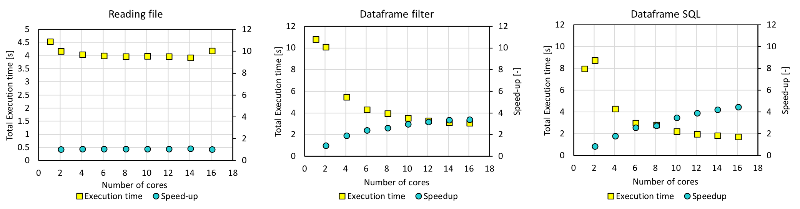
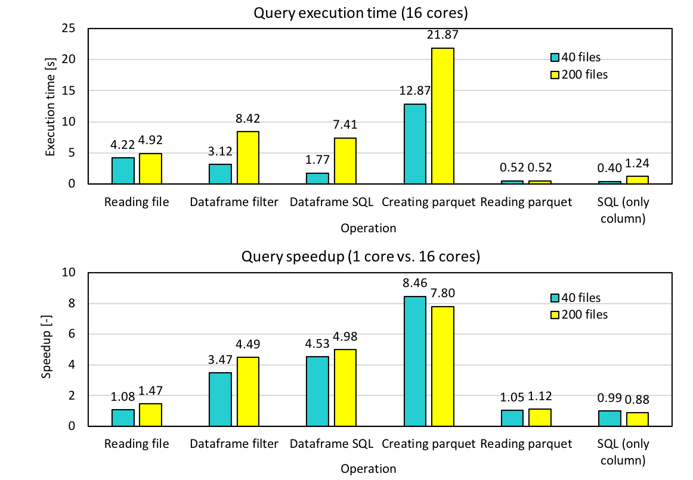
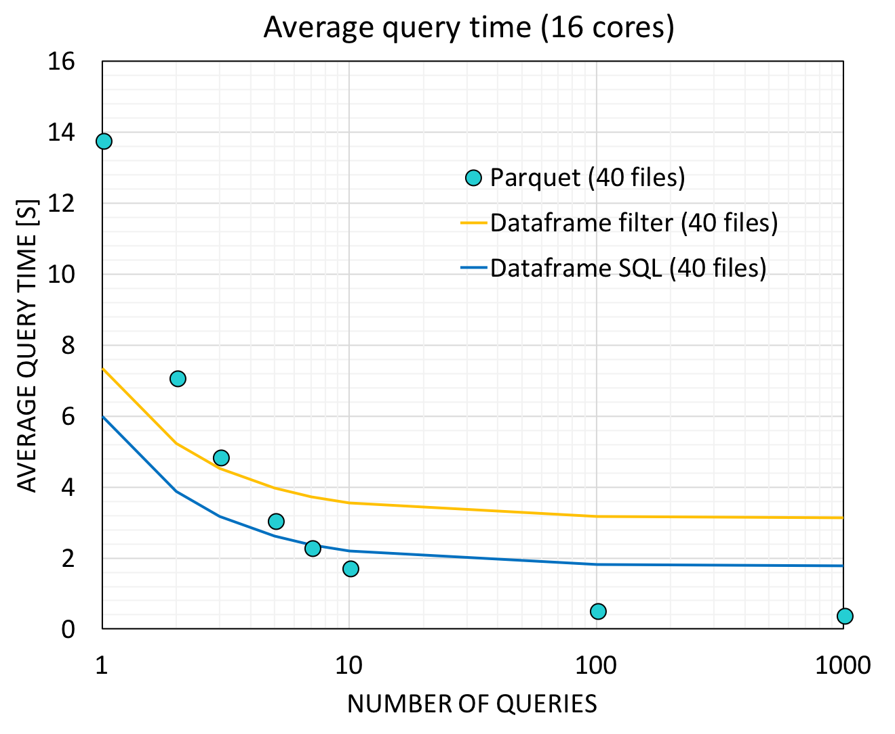

### Serial Loading with Standard Python code

The following is the result of executing serial_query_profile.py on AWS. It collected the displacements and electronic coupling (to be collectively called "coupling") between two orbital "11"'s (atom_from_index=11, atom_to_index=11), from 40 files and 200 files. 

The mere serial query (shown with blue bars) took 13 s to query 40 files, and the execution time was directly proportional to the number of files. It takes approximately 130 s to collect the coupling for a single pair of orbitals query from 400 files so this shows that we needed a more efficient way as we are querying a few hundred times. The query using a worker Pool with 12 workers decreased the execution time to 1/6 - 1/7. However, it still takes 8.8 s for 200 files, which will become 15 min if we were to query 100 times.

### Loading using Spark Cluster with m4.2xlarge Instances

#### Dataframe Filtering and Spark.sql

A Spark version of the query code that is included in spark_query.py was run on a Spark cluster with one Master and two Worker m4.2xlarge instances. m4.2xlarge was chosen as it has 8 vCPUs and using two of it allowed us to test our codes with 12 cores, which is what the workstation has. This code first creates a dataframe and uses dataframe.filter() to collect the couplings, and also creates a temporary view and runs spark.sql on it. The query above (collecting information for orbital 11 - orbital 11 coupling) for 40 files was also tested here. The next figure shows the execution time and speedup as a function of the number of cores. 

With 12 cores, the execution time of 4 s for dataframe.filter() and that of 3 s for spark.sql were obtained. However, the execution time increased slightly for larger number of cores, most likely because the actual number of cores in the instance is smaller due to hyperthreading. For this reason we decided to use m4.4xlarge instances. 

### Loading using Spark Cluster with m4.4xlarge Instances

#### Dataframe Filtering and Spark.sql
The same experiment was done with m4.4xlarge instances, which have 16 vCPUs each, and the following is the results. 

The execution time decreased as expected, and the query took 3.35 s with dataframe.filter() and 2.04 s with spark.sql. However, this was not much faster than the multiprocessing result.

#### Parquet + Spark.sql

In order to improve the execution time, we turned to the [parquet format](https://spark.apache.org/docs/latest/sql-programming-guide.html#parquet-files). A single script first created a parquet file with data partitioned according to orbital indices (atom_from_index and tom_to_index), read and registered the partitioned table as a temporary view, and ran spark.sqp on it. The following is the execution time of each operation, for again, 11-11 coupling. 

With 12 cores, parquet creation took 15.6 s, reading it took 0.528 s, and running spark.sql took 0.431 s. The parquet file needs to be generated only once for any number of queries done on the parquet. Therefore the average query time using 16 cores was calculated for different number of queries and the result is shown below. 

If query was to be done 10 times, the parquet method will be as fast as running spark.sql directly on the dataframe. Because we will conduct a few hundred queries in the actual implementation, the parquet method is the way to go. For 100 queries, the average time per query is 0.537 s and 0.417 s for 1000 queries. 

#### Experiment with 200 files

Now we executed the code with 200 files and the execution time and speedup are shown below. 

#### Query + TBH Model Building

Having developed the query code, we combined it with the interpolation code that builds the TBH models, in generate_model.py. This code first creates a parquet, reads the parquet and creates a temporary view, and queries it about 300 times to populate the TBH matrix. The execution time and speedup were compared for different number of cores using 40 files. We also tested how partitioning when creating the parquet affects the total time. 

With a parquet that contained the data partitioned by atom_from_index and atom_to_index, which are the keys when querying, the execution time was as low as 150 s (figure on the right). While the execution time decreases with increasing number of cores for the parquet without partitioning, the execution time does not change for the fully partitioned data. In order to further improve our code, parallelization of the interpolation part will be necessary, and this is will be our next task. 

#### Tuning

One of the most important performance tuning aspects for Spark SQL is caching data in memory. This could be achieved by using spark.cacheTable() or dataframe.cache(). The whole dataframe, containing all the data from 400 files, is obviously too big to cache. What we could cache is the output from SQL, and this would help with following interpolation. But from Spark documentation, Spark SQL caches Parquet metadata automatically for better performance. This could be indirectly proved by running the same query multiple times. As shown in the figure below, we ran the same query (from orbital 11 to orbital 11) on 400 data files with 12 cores on the workstation multiple times, continuously. Running the query for the first time took about 1.5s, but later on it went down. Because we are querying the exact same data multiple times and it is cached in memory, the queries seem to get faster. 

There are also some other configurations that we can play with, including split computation, broadcast join threshold, shuffle partitions. We tested our code with these configurations using 16 cores and 200 files, but it does not benefit much from the tuning. The detailed results are shown as below. 

It seems that partitioning is benefiting a little from increase of shuffle partitions, but we did not see big changes for all the others. Partitioning here refers to transformation of data structure from dataframe to partitioning table. We did run partitionBy in this part and this could possibly explain the improvement brought by changing shuffle partitions. But for the others, since in our case there is no heavy computation or multiple join/aggregation operations duing the query, most of the configuration settings are not expected to make a big difference on the performance. 

## VASP+Wannier Profiling
The main workhorse to generate the data is the VASP code which is a commercial DFT code. We are not changing the code for the purpose of the class project, however we would like to gauge the performance of this DFT code in terms of the number of CPU used to execute the code. However, we note that this is a very complicated code and depending on the number of CPUs used to execute the code, the default parameters in performing the simulation would adjust themselves as well. For example, the number of bands in the electronic structure will be changed to be the multiples of the number of the CPUs. This means, it will not be completely fair to compare the performance depending on the number of CPUs. However, we can still roughly see how the performance scale at the size of our crystal structure and simulation scale here. We find about 6-8 CPUs are suitable for running the simulation.

## Post-Processing
The Postprocessing script reads the information from the corresponding POSCAR (crystal structure) and hamiltonian modeling file (*_hr.dat) and the implementation can be found in rec_proc.py. This will go through the all 400 sets of files from the output to process them into more intuitive files (new_proc_wan_*) which contains the atomic couplings. This script can be parallelized by multiprocessing module provided in the standard Python interpreter. As in the plot, we observe the improved performance when we parallelize the data processing. The benchmark is done with a subset (100 sets) of the full data (400 sets) we have. The machine we have has 12 physical cores and we investigate the performance up to 12 cores using pool function in multiprocessing toolkit. As the note, we also test the performance for data stored on the solid state drive and the conventional magnetic hard disk. The solid state drive provides slightly better performance over the conventional magnetic storage device.

# [>> Results and Discussion >>](https:stevetorr.github.io/wannier_shift/results)
# [<< Guide to using Code <<](https://stevetorr.github.io/wannier_shift/guide)
