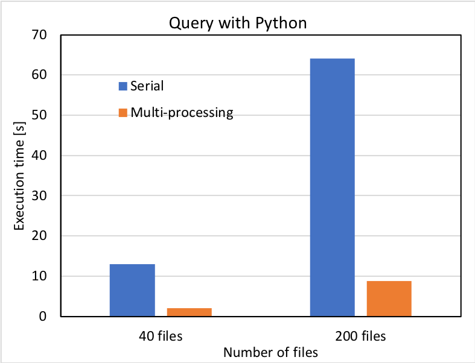
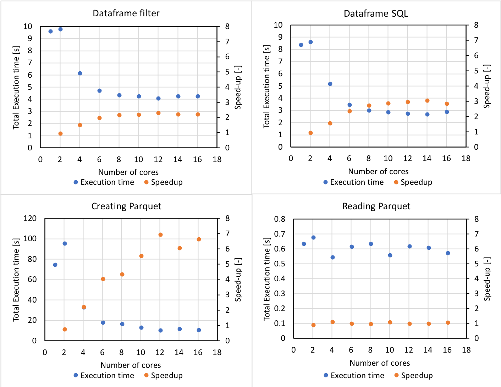
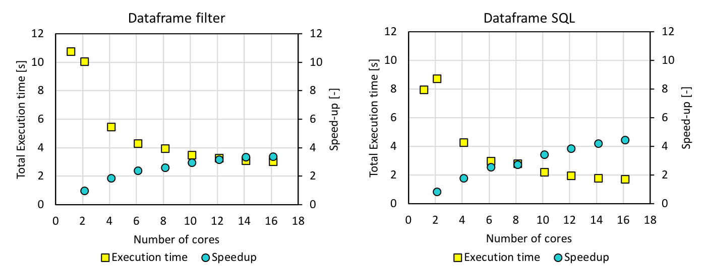
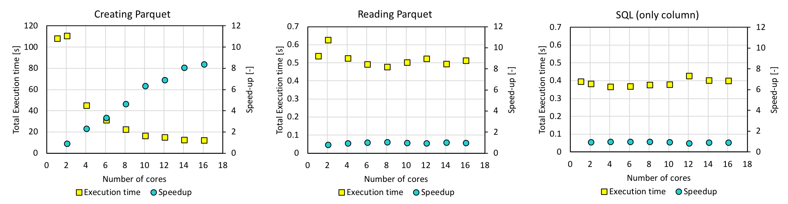
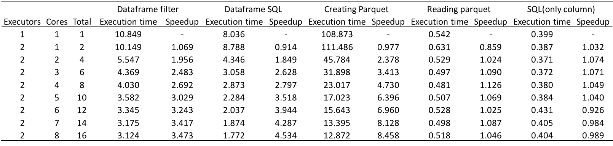
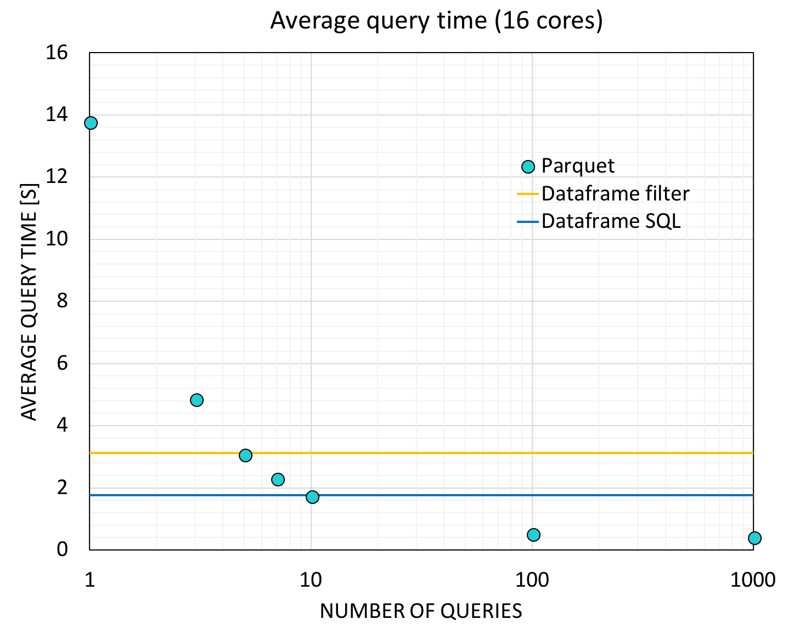
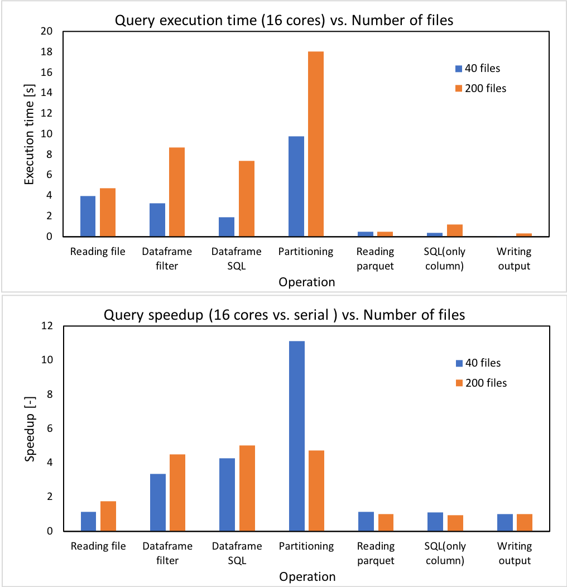

### Serial Loading with Standard Python code

The following is the result of executing serial_query_profile.py on AWS. It collected the displacements and electronic coupling (to be collectively called "coupling") between two orbital "11"'s (atom_from_index=11, atom_to_index=11), from 40 files and 200 files. The mere serial query (shown with blue bars) took 13 s to query 40 files, and the execution time was directly proportional to the number of files. It takes approximately 130 s to collect the coupling for a single pair of orbitals query from 400 files so this shows that we needed a more efficient way as we are querying a few hundred times. The query using a worker Pool with 12 workers decreased the execution time to 1/6 - 1/7. However, it still takes 8.8 s for 200 files, which will become 15 min if we were to query 100 times.

### Loading using Spark Cluster with m4.2xlarge Instances

#### Dataframe Filtering and Spark.sql

A Spark version of the code that is included in spark_query.py was run on a Spark cluster with one Master and two Worker m4.2xlarge instances. m4.2xlarge was chosen as it has 8 vCPUs and using two of it allowed us to experiment with 12 cores, which is what the workstation has. This code created a dataframe and used dataframe.filter() to collect the couplings, and also created a temporary view and ran spark.sql on it. The query above (collecting information for orbital 11 - orbital 11 coupling) for 40 files was also tested here. The next figure shows the execution time and speedup as a function of the number of cores. With 12 cores, the execution time of 4 s for dataframe.filter() and that of 3 s for spark.sql were obtained. However, the execution time increased for larger number of cores, most likely because the actual number of cores in the instance is smaller due to hyperthreading. 

### Loading using Spark Cluster with m4.4xlarge Instances

#### Dataframe Filtering and Spark.sql
The same experiment was done with m4.4xlarge instances, which have 16 vCPUs each, and the following is the results. The execution time decreased as expected, and the query took 3.35 s with dataframe.filter() and 2.04 s with spark.sql. However, this was not much faster than the multiprocessing result.

#### Parquet + Spark.sql

In order to improve the execution time, we turned to the [parquet format](https://spark.apache.org/docs/latest/sql-programming-guide.html#parquet-files). A single script first created a parquet file with data partitioned according to orbital indices (atom_from_index and tom_to_index), read and registered the partitioned table as a temporary view, and ran spark.sqp on it. The following is the execution time of each operation, for again, 11-11 coupling. With 12 cores, parquet creation took 15.6 s, reading it took 0.528 s, and running spark.sql took 0.431 s. 

The parquet file needs to be generated only once for any number of queries done on the parquet. Therefore the average query time using 16 cores was calculated for different number of queries and the result is shown below. If query was to be done 10 times, the parquet method will be as fast as running spark.sql directly on the dataframe. Because we will conduct a few hundred queries in the actual implementation, the parquet method is the way to go. For 100 queries, the average time per query is 0.537 s and 0.417 s for 1000 queries. 

#### Experiment with 200 files

Now we executed the code with 200 files and the execution time and speedup are shown below. 

