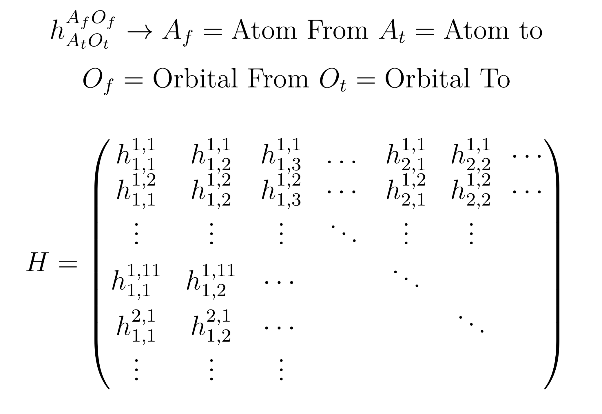
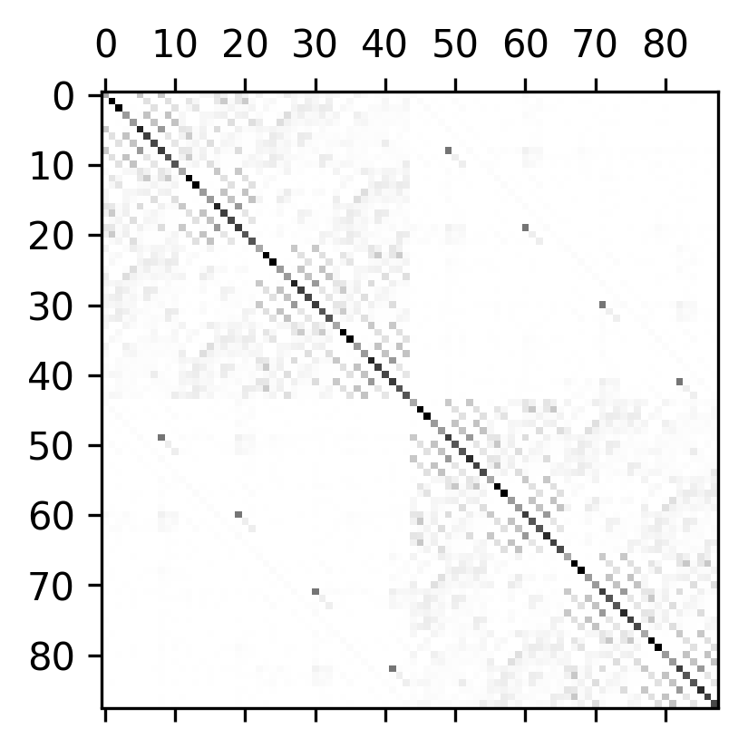
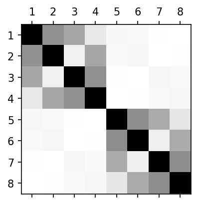
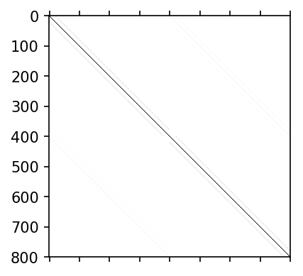

## Results

### The Tight-Binding Hamiltonian

Because the tight-binding Hamiltonian is merely a matrix which indexes the couplings between individual orbitals, it is possible to visualize it very easily and intuitively through standard plotter tools. 

## 
### The form of a tight-binding Hamiltonian, explained. For a system with N atoms, the tight-binding Hamiltonian is (11N)x(11N) in dimension. We partition the matrix into 11x11 submatrices which represent individual unit cells, henceforth "atoms", and their 11 orbitals (5 d orbitals and 6 p orbitals).

For conceptual clarity, even though each monolayer unit cell has three atoms, we will consider a "superatom" of three atoms per atom, which can be thought of as as simply rolling the 5 d orbitals and 6 p orbitals across the metal and chalcogens into one atom with 11 orbitals. Thus, henceforth, every 'atom' has 11 orbitals.

While the coupling can be positive or negative (negative for attractive, positive for repulsive) depending on the orbitals themselves, by taking the absolute value of the value of each coupling we can produce an intuitive visualization of the TBH. 

We generated a very small flake of TaS2 with only 8 atoms total, 4 per bilayer, and then produced a set of matrices to demonstrate the coupling between individual orbitals as seen below.

## 
### The atoms are arranged so that the lower-level atoms are in the upper-left quadrant, and upper-level atoms are in the lower-right quadrant. Therefore, the comparative weakness of the interlayer coupling can be seen by the fact that it is barely visible next to the much stronger intralayer coupling.

We also produce "renormalized"  matrices to make it clear very crudely how strongly coupled individual atoms are; we simply sum up the absolute value of every matrix element in every 11 X 11 submatrix of the overall TBH, turning an 88 X 88 matrix into an 8 X 8 one, as seen below.

## 
### We can see weak interlayer couplings even better here. Note the matrix is symmetric and that the top and bottom layers have the same interaction energy.

For completeness, we also include a huge plot of 800 atoms (the following being the 'renormalized' version):

## 
### Close inspection reveals stripes about the diagonal-- which are the nearest neighbors of the atom in vquestion -- as well as along the upper-right and lower-left interlayer quadrants.

## Discussion and Outlook

Insofar as the scope of the project was to compile a database which allows for easy lookup and generation of TBH models, the project was unambiguously a success, generating the TBH models relatively quickly. This would allow us to sample a wide variety of configurations effectively.

In the future, we still have features we would like to add. We have demonstrated the proof-of-princple for generating a TBH for a bilayer flake of TaS2. A next step is to extend the code to handle periodic systems and create a Hamiltonian with the appropriate couplings. Another next step would be to try to compute the properties of a given system from the TBH, such as obtaining eigenvalues out from the TBH or by using it to study properties like the optical response of chiral light.

### Validation tests for the TBH
In the future, We would want to perform validation tests on our TBH. These would most likely require us to extend the code to periodic systems, as samples are large enough in experiment such that we can approximate them as infinite on the scale of quantum behavior. Then we could compare the band structure which results from our TBH with those coming from DFT, or conventional Wannier functions for periodic systems.

### Future Directions/Expansions: Physics/Simulations
The two-dimensional layered heterostructure stack holds promising applications in the electronics and fundamental physics research. To facilitate and implement the fast screening and simulation of the electronic properties for the stacks, the database tools developed here paves the groundwork for the future studies. With the infrastructure built for the material database, the data generation for various layer types can be automated. 

The generalization includes variations of the crystal geometry and configuration used for the simulation such as the deformations of the layer geometry from the strain perturbations, the height variations from the compressed pressure applied, various constituent atoms in the layers, etc. Massive atomic coupling information can be extracted from these simulations and the database is suitable to be used to manage the data set and to bridge other applications. For example, one might envision the machine learning algorithm developed to extract and model the feature for the atomic coupling and the dependence on the local environment. This would allow the prediction and modeling of the atomic coupling give a local configuration that appear in the stacked layers (locally). 

The database itself is also very useful to be used to visualize the atomic coupling depending on each orbital type, or used to derive simpler effective low-energy models for theoretical physics research. The simulation would then guide the fabrication of the devices and make the prediction of their physical properties. On the other hand, because of the layer geometry, the layer materials can also be probed by various experimental methods such as scanning tunneling microscope or optical measurements. These probing techniques directly access the electronic properties and can be used to validate the predications we have for the layer stacks. This would give feedback for the theoretical modeling and further improve the quality for the simulation method. Our method is designed to retain the information from first principle calculations (DFT) and can be improved systematically without any unjustified ad hoc ansatz or assumptions for the atomic coupling. A database that manage the set of atomic coupling data is highly relevant for the field of studies on these two-dimensional layered materials and their simulations. 

# [^^ Back to Header ^^](https://github.com/stevetorr/wannier_shift/header)
# [<< Profiling Information](https://github.com/stevetorr/wannier_shift/blob/master/docs/profile.md)
# [^^
